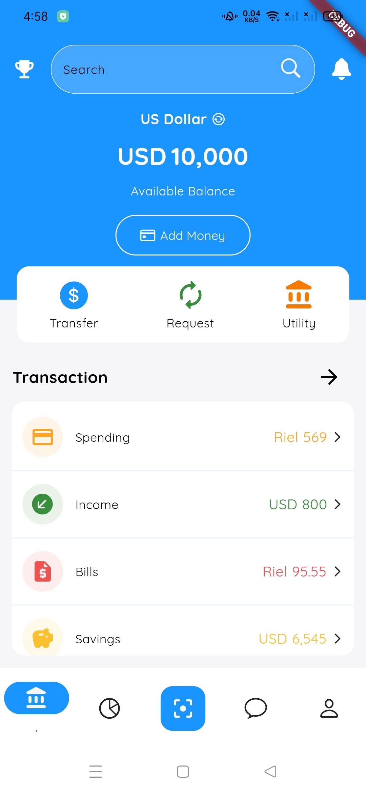
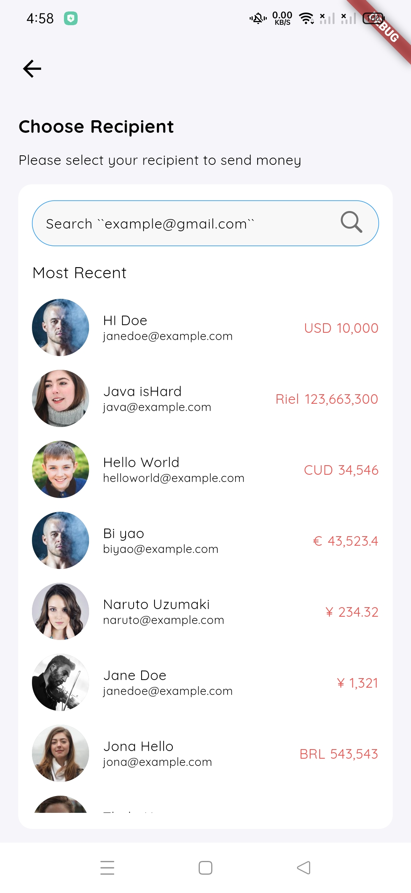

# About Project
This is a Flutter application that uses Material 3 to create a bank application UI.

## Used Packages

* cupertino_icons: ^1.0.2
* google_fonts: ^2.2.0
* flutter_launcher_icons: ^0.9.2
* flutter_native_splash: ^1.3.2
* intl: ^0.17.0
* cached_network_image: ^3.2.0

### Font 
  * QuickSand (EngLish)

# Screenshot:

  
    

